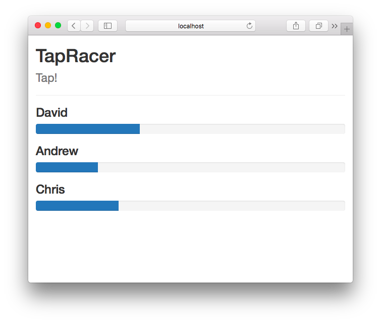
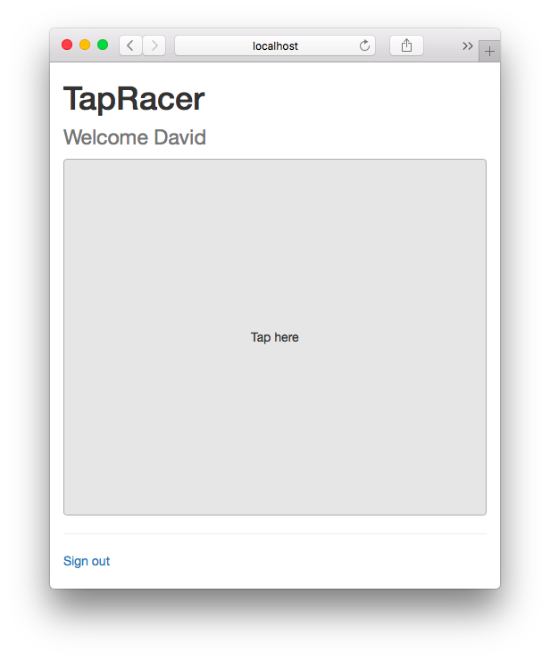

# TapRacer

To start your Phoenix server:

  * Install dependencies with `mix deps.get`
  * Install Node.js dependencies with `cd assets && yarn install`
  * Start Phoenix endpoint with `mix phx.server`

Visit [hostname:4000/console](http://hostname:4000/console) on your desktop to view the game console. Replace `hostname` with your LAN IP address or hostname.

Visit [hostname:4000](http://hostname:4000/) on one or more mobile devices. From here you choose a name and join the game. Your mobile device is your controller. When the game starts, tap the big button as fast as you can. Be the first to the end.

Tap your way to victory.
